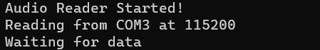
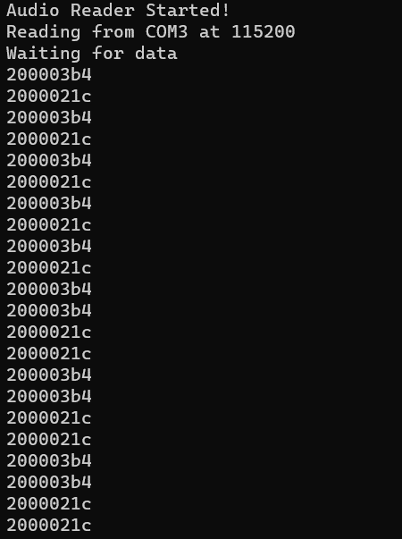

# CC2650 Sensortag Microphone

## Getting started 
Please use the Code Compose Studio to import the template project:  
1. Clone this project in a folder on your PC. 
2. Open Code Composer Studio > File > Import.  
3. Select Code Compose Studio, then select CCS projects. Go to NEXT.  
4. Click Browse and select the ccs folder from this repository. Then Click Finish.  
5.  Click Project > Build All,  follow by Run > Debug 

Next, launch the script in your git clone folder using this command:
*python3 audio_frame_serial_print.py COM3 32 NONE -b 115200*

You should now see the following image:

Also, the sensor board led should now be RED. 
## Sending and Receiving data
To transmit, press the left button of of the board. (just try either of the button first to determine which is the START button). Once u press the "START" button, you will see the board led turn into flashing green.

**Board LED -> RED : Stopped Recording (Press right button)**

**Board LED -> Flashing green: Recording in progress (Press left button)** 

Note: Before launching this step, ensure your CCS is in debug mode, and your script is already running.

If everything went fine, you should be able to see the data coming in:

## Updates 
21 Oct : the UART is printing in HEX values of sensor mic values. 
Try not to mess with the *mic_test.c* unless necessary. Otherwise, any issues can contact me directly. 
