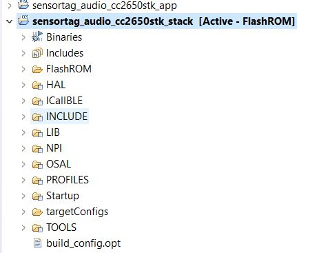
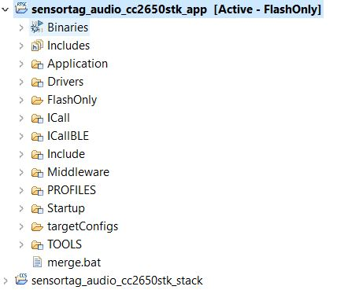
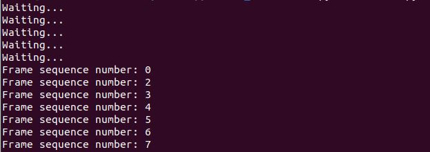

# CC2650 Sensortag Microphone

## Importing Projects into CCS
Please use the Code Compose Studio to import the template project:  
1. Clone this project in a folder on your PC. 
2. Open Code Composer Studio > File > Import.  
3. Select Code Compose Studio, then select CCS projects. Go to NEXT.  
4. Click Browse to your git folder, and select BOTH the sensortag_audio_cc2650stk_app and the sensortag_audio_cc2650stk_stack folder. Then TICK BOTH project that appeared automatically in your window. 

## Build, Compiler & Run on SensorTag
Follow these steps carefully. 
1. On the left of CCS, double click on the **stack** project to make it your active project 

2. Now Build this project as per how you normally do, (Project > Build Project). 
3. Next, Run > Debug as > Code Composer Debug Session 
4. Click on the green "Resume" Button (triangle play button) 
5. Wait a while (5 second) then Click on red "Terminate" Button (stop button)
6. On the left of CCS, double click on the **app** project to make it your active project 

7. Now Build this project as per how you normally do, (Project > Build Project). 
8. Next, Run > Debug as > Code Composer Debug Session 
9. Click on the green "Resume" Button (triangle play button) 
10. But Do Not Terminate It.

## Sending and Receiving data
Before Launching the script, your sensortag needs to having a flashing green light, which indicates that it is advertising. Click on the button that is further away from your USB port ONCE to start advertising. Wait 2 sec, you should see the flashing green light. 

Now, you can Launch the script in your git folder using this command:
*python3 audio.py*

Once Connected, the flashing green light will stop flashing, and Your script terminal will start printing "Waiting...". 

To transmit, press the left button of of the board. (just try either of the button first to determine which is the START button). Once u press the "START" button, you will see the board led turn into flashing green.

Previously:
**Board LED -> RED : Stopped Recording (Press right button)**
**Board LED -> Flashing green: Recording in progress (Press left button)** 

Now: 
**Board LED -> RED : Start Recording (Press & HOLD right usb button)**
**Board LED -> RED : Stop Recording (Release right usb button)**
**Board LED -> Flashing green: Advertising (Press left button once)** 
**Board LED -> Flashing green: Stop Advertising (Press left button again)** 

If everything is done correctly, you should see:

 

## Getting the .wav files 
Currently, upon collecting 600 frames which corresponds to roughly 0.06 second of wav file. The script will save the .wav files into a folder called samples. 

## Updates 
21 Oct : the UART is printing in HEX values of sensor mic values. 
Try not to mess with the *mic_test.c* unless necessary. Otherwise, any issues can contact me directly. 

28 Oct : UART is now printing correctly, and able to transmit properly. Although there are still some losses, but basic architecture completed, enabling SW ML training. 

10 Nov:  Bluetooth Capabilities enabled. 
